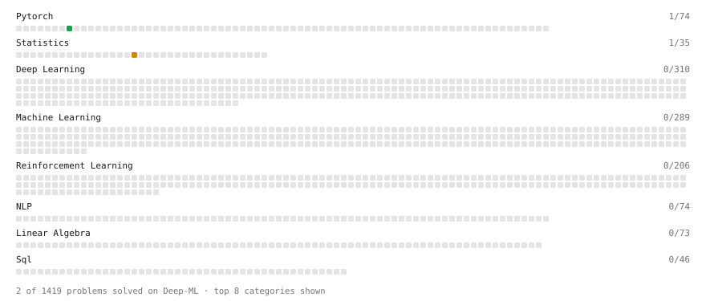

# Deep-ML

My machine learning practice from [Deep-ML](https://www.deep-ml.com). Every solution here was written by hand.

**6** solved · 6 problems · 0 labs · 0 math

[**Browse the interactive portfolio**](https://Anirudh-Senani.github.io/deep-ml/) to replay this filling in over time.

## Problems

| | Difficulty | Solved | |
| --- | --- | --- | --- |
| [Build an MLP with nn.Sequential](https://www.deep-ml.com/problems/887) | easy | 2026-09-15 | [solution](problems/0887-build-an-mlp-with-nn-sequential) |
| [Rejection Sampling Best-of-K Selection](https://www.deep-ml.com/problems/768) | easy | 2026-09-21 | [solution](problems/0768-rejection-sampling-best-of-k-selection) |
| [BIRCH Clustering for Large Datasets](https://www.deep-ml.com/problems/825) | medium | 2026-09-20 | [solution](problems/0825-birch-clustering-for-large-datasets) |
| [Find the Best Gini-Based Split for a Binary Decision Tree](https://www.deep-ml.com/problems/138) | medium | 2026-09-24 | [solution](problems/0138-find-the-best-gini-based-split-for-a-binary-decision-tree) |
| [Omitted-Variable Bias](https://www.deep-ml.com/problems/1358) | medium | 2026-09-17 | [solution](problems/1358-omitted-variable-bias) |
| [Trade Compute for Memory with Gradient Checkpointing](https://www.deep-ml.com/problems/1342) | hard | 2026-09-23 | [solution](problems/1342-trade-compute-for-memory-with-gradient-checkpointing) |

---

_This file is regenerated by Deep-ML on every push._
